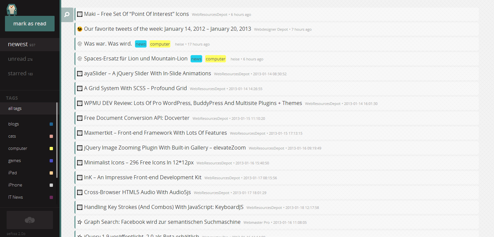

<!--
N.B.: This README was automatically generated by <https://github.com/YunoHost/apps/tree/master/tools/readme_generator>
It shall NOT be edited by hand.
-->

# Selfoss for YunoHost

[](https://dash.yunohost.org/appci/app/selfoss)  

[](https://install-app.yunohost.org/?app=selfoss)

*[Read this README in other languages.](./ALL_README.md)*

> *This package allows you to install Selfoss quickly and simply on a YunoHost server.*  
> *If you don't have YunoHost, please consult [the guide](https://yunohost.org/install) to learn how to install it.*

## Overview

Selfoss is a multipurpose RSS reader and feed aggregation web application. It allows you to easily follow updates from different web sites, social networks and other platforms, all in single place. It is written in PHP, allowing you to run it basically anywhere.


**Shipped version:** 2.19~ynh4

## Screenshots



## Documentation and resources

- Official app website: <https://selfoss.aditu.de/>
- Official user documentation: <https://selfoss.aditu.de/>
- Official admin documentation: <https://github.com/fossar/selfoss/wiki>
- Upstream app code repository: <https://github.com/fossar/selfoss>
- YunoHost Store: <https://apps.yunohost.org/app/selfoss>
- Report a bug: <https://github.com/YunoHost-Apps/selfoss_ynh/issues>

## Developer info

Please send your pull request to the [`testing` branch](https://github.com/YunoHost-Apps/selfoss_ynh/tree/testing).

To try the `testing` branch, please proceed like that:

```bash
sudo yunohost app install https://github.com/YunoHost-Apps/selfoss_ynh/tree/testing --debug
or
sudo yunohost app upgrade selfoss -u https://github.com/YunoHost-Apps/selfoss_ynh/tree/testing --debug
```

**More info regarding app packaging:** <https://yunohost.org/packaging_apps>
