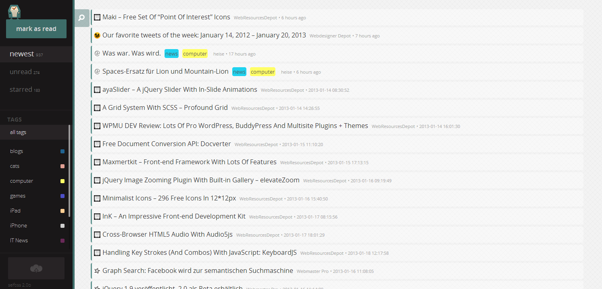

<!--
NOTA: Este README foi creado automáticamente por <https://github.com/YunoHost/apps/tree/master/tools/readme_generator>
NON debe editarse manualmente.
-->

# Selfoss para YunoHost

[](https://ci-apps.yunohost.org/ci/apps/selfoss/)  

[](https://install-app.yunohost.org/?app=selfoss)

*[Le este README en outros idiomas.](./ALL_README.md)*

> *Este paquete permíteche instalar Selfoss de xeito rápido e doado nun servidor YunoHost.*  
> *Se non usas YunoHost, le a [documentación](https://yunohost.org/install) para saber como instalalo.*

## Vista xeral

Selfoss is a multipurpose RSS reader and feed aggregation web application. It allows you to easily follow updates from different web sites, social networks and other platforms, all in single place. It is written in PHP, allowing you to run it basically anywhere.


**Versión proporcionada:** 2.19~ynh4

## Capturas de pantalla



## Documentación e recursos

- Web oficial da app: <https://selfoss.aditu.de/>
- Documentación oficial para usuarias: <https://selfoss.aditu.de/>
- Documentación oficial para admin: <https://github.com/fossar/selfoss/wiki>
- Repositorio de orixe do código: <https://github.com/fossar/selfoss>
- Tenda YunoHost: <https://apps.yunohost.org/app/selfoss>
- Informar dun problema: <https://github.com/YunoHost-Apps/selfoss_ynh/issues>

## Info de desenvolvemento

Envía a túa colaboración á [rama `testing`](https://github.com/YunoHost-Apps/selfoss_ynh/tree/testing).

Para probar a rama `testing`, procede deste xeito:

```bash
sudo yunohost app install https://github.com/YunoHost-Apps/selfoss_ynh/tree/testing --debug
ou
sudo yunohost app upgrade selfoss -u https://github.com/YunoHost-Apps/selfoss_ynh/tree/testing --debug
```

**Máis info sobre o empaquetado da app:** <https://yunohost.org/packaging_apps>
